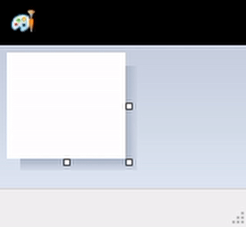

# Raspberry Pi Mouse Jiggler

This repository hosts Arduino code for turning an Arduino Leonardo into a mouse
jiggler.

## What? Why?

A mouse jiggler is a either a hardware appliance of a software program for mouse
cursor movement automation for the purpose of preventing a computer from going
to sleep. Sometimes software-based solutions are locked down by IT departments
at which point hardware-based solutions save the day.

## Inspiration

While researching how to implement this, I've found that someone has already
done exactly what I intended: [Raspberry Pi Pico - DIY USB Mouse Jiggler].

[Raspberry Pi Pico - DIY USB Mouse Jiggler]: https://www.youtube.com/watch?v=MjCFJCfq8ko

The person also made his code available on GitHub: [novaspirit/PicoMouseJiggler]

[novaspirit/PicoMouseJiggler]: https://github.com/novaspirit/PicoMouseJiggler

## Code

```python
import time
import usb_hid
from adafruit_hid.mouse import Mouse

mouse = Mouse(usb_hid.devices)

shift = 2
wait = 0.25

while True:
  mouse.move(x=shift, y=shift)
  time.sleep(wait)
  mouse.move(x=shift, y=-shift)
  time.sleep(wait)
  mouse.move(x=-shift, y=-shift)
  time.sleep(wait)
  mouse.move(x=-shift, y=shift)
  time.sleep(wait)
```

This code will move the mouse in a diagonal shape, staying around the origin and
not sliding off.



## Raspberry Pi

I'm using a Raspberry Pi Pico:

1. Press and hold the <kbd>BOOTSEL</kbd> button on the Pi Pico
2. Connect the Pico to the computer using a data+power USB cable
3. Find the RPI-RP2 mass storage device that should mount and release the button
4. Download CircuitPython UF2 https://circuitpython.org/board/raspberry_pi_pico
5. Wait for the RPI-RP2 drive to unmount itself and reconnect it to the computer
6. Wait for a new device to mount called CIRCUITPY
7. Go to https://github.com/adafruit/Adafruit_CircuitPython_HID and download it
8. Move `adafruit_hid` from the downloaded repository over to `CIRCUITPY/lib`
9. Open `CIRCUITPY/code.py` and edit it to have the above content

There seems to be an issue with macOS currently:

https://github.com/adafruit/Adafruit_CircuitPython_HID/issues/59

Everything works as expected on Windows.

## Arduino

I've implemented a Raspberry Pi based mouse jiggler in a complementary repo:
https://github.com/TomasHubelbauer/arduino-mouse-jiggler

## To-Do

### Verify the code now works on macOS out of the box after the issue fix

https://github.com/adafruit/circuitpython/issues/4532

### Build adapters from the microUSB port on the Pi Pico to USB A and USB C

- https://www.gme.cz/konektor-usb-az
- https://www.gme.cz/usb-konektor-micro-usb-b-new

Buy these connectors and find somewhere to buy a USB C one, solder the adapters
together and use the mouse jiggler by directly connecting it to the computer
using the adapter instead of using a short cable which makes it flail around and
be overall ugly.
